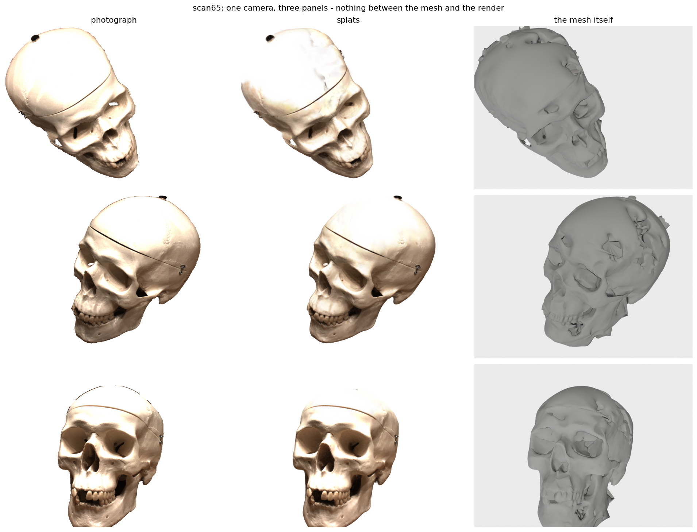
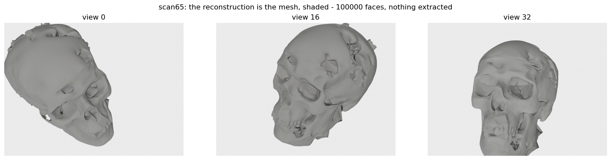
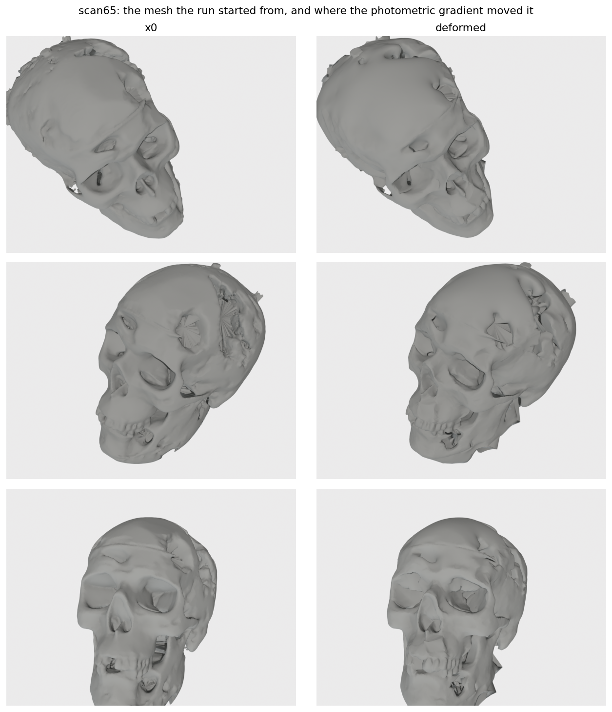

# DEC-3DGS

A personal project to explore **Gaussian splatting and Discrete Exterior Calculus (DEC)**:
how to render a surface with Gaussian patches, differentiate an image loss through its geometry,
and use mesh operators to couple appearance and guide deformation.

I wanted to see what happens when the Gaussians belong to a triangle mesh instead of moving
independently. This repository contains the implementation, a reconstruction example and the
things I learned while putting them together.

Despite the name, the renderer used here is **2D Gaussian Splatting**: oriented Gaussian discs
in 3D space, rather than volumetric 3D Gaussians. Rendering uses the official 2DGS surfel
rasterizer. The mesh construction, DEC operators and their integration with training are
the focus of this repository.



*Each row uses the same dataset camera for the photograph, splats and mesh. The splats reproduce
much of the appearance, while the shaded surface reveals roughness and missing geometric detail.
A convincing image is not the same thing as an accurate surface.*

## How it works

The input is a set of calibrated photographs and an initial mesh obtained from a pretrained
2DGS reconstruction. One Gaussian splat is attached to each triangle. During training, the
vertices move and colour and opacity are learned, but the mesh connectivity stays fixed.

The splat geometry is derived from the current mesh at every render:

- **Position:** the triangle's circumcentre, moved back inside the face when the triangle is obtuse.
- **Orientation:** the face normal and tangent directions estimated from the shape operator.
  Near umbilic regions, where principal directions are ambiguous, training blends toward a
  transported reference direction.
- **Size:** the extent of the neighbouring dual edges along those tangent directions, with a
  cap to prevent oversized splats.
- **Appearance:** spherical-harmonic coefficients for view-dependent colour and an opacity
  logit, learned separately for each face.

An image loss compares the rendered view with its photograph. Gradients reach the vertices
through the splats' positions, frames and scales. Geometric regularizers discourage normal
jumps and distorted triangles; an appearance regularizer couples neighbouring faces.

The initial mesh must be extracted once, but there is **no surface extraction after deformation**:
the optimized mesh is already available.



*The surface itself, without learned colour or opacity. Keeping it explicit makes it easy to
inspect what the image-fitting process actually changed.*

## Where DEC enters

DEC provides discrete versions of differentiation, integration and diffusion on the mesh.
Here it has two practical roles: smoothing fields on faces and coupling motion across vertices.

### Operators on the mesh

Values on vertices, edges and faces are cochains. The signed incidence matrices `d0` and `d1`
encode the exterior derivative, with the exact identity

```text
d1 d0 = 0.
```

Metric information enters through Hodge stars and mass matrices. The vertex stiffness matrix is
written with the positive-semidefinite convention,

```text
L0 = d0^T star1 d0,       L0 1 = 0.
```

Thus `M^(-1) L0` discretizes the negative of `Delta = div grad`. A corresponding dual operator
`L2` acts on values stored on faces. The implementation uses established geometry libraries
for assembly, with tests for identities and known geometry: Gauss-Bonnet, sphere curvature,
parallel transport and spectral filtering.

See [mesh.py](dec3dgs/mesh.py) for the conventions and constructions, and
[the tests](tests/) for checks against known geometry.

### Coupling appearance

Each spherical-harmonic coefficient and the opacity logit is a scalar field on faces.
Their coupling is a discrete Dirichlet energy:

```text
L_field = sum_l c_l^T L2 c_l + mu o^T L2 o.
```

It penalizes variation between neighbouring faces. The implementation divides by face count
to calibrate its weight; this is a numerical convention, not a guarantee of invariance under
mesh refinement.

The same operator can diffuse a painted edit across the surface through an implicit heat step:

```text
(M2 + t L2) c_new = M2 c_initial.
```

This follows mesh connectivity, so nearby surfaces separated by a thin gap need not exchange
colour. It is distinct from training with a smoothness penalty: that penalty alone did **not**
produce the hoped-for geodesic edit behaviour in the tested settings.

See [losses.py](dec3dgs/losses.py) and [edit_demo.py](scripts/edit_demo.py).

### Guiding deformation

An ordinary coordinate gradient treats vertex coordinates independently. A Sobolev metric
introduces a spatial coupling through the mesh:

```text
g_filtered = (M + t L0)^(-1) g.
```

The filtered gradient is passed to Adam. This changes how the optimizer moves the surface,
rather than adding another term to the objective.

The associated mass-weighted filter has a useful spectral interpretation. If
`L0 phi = lambda M phi`, then

```text
(M + t L0)^(-1) M phi = phi / (1 + t lambda).
```

High-frequency modes are attenuated more strongly, while constant fields are preserved.
The parameter `t` has units of area, with `sqrt(t)` setting a smoothing length scale.
This identity describes the linear filter, not the complete Adam update. It does not prevent
triangles from collapsing.

See [metric.py](dec3dgs/metric.py) and [deform.py](dec3dgs/deform.py).

## What changed in the reconstruction



*Initial mesh on the left, optimized mesh on the right. The overall shape was already present.
Deformation changes local features but also leaves artifacts, especially around fine structures.
Fixed connectivity limits what the surface can become.*

The illustrated run uses DTU `scan65`, seed 0, 4,000 optimization steps, 100,000 faces and
49,879 vertices, on a GTX 1050 with 3 GiB of memory.

| Measurement | Recorded value |
|---|---:|
| Initial mesh Chamfer distance | 1.5170 mm |
| Deformed mesh Chamfer distance | 1.4580 mm |
| Accuracy / completeness | 1.5825 / 1.3334 mm |
| Training-view PSNR | 26.48 dB |
| Peak allocated GPU memory | 1006 MiB |

Chamfer is the mean of the two directed distances under the DTU reference protocol; lower is
better. PSNR measures image agreement, not geometric accuracy, and these DTU views were used
for training.

These measurements belong to the saved historical run, before the latest numerical and
checkpoint fixes. Its checkpoint did not save the tangent-frame reference, so the illustrated
splat replay is approximate. Camera choices and figure provenance are recorded in
[figures.json](docs/images/figures.json). The corrected code has passed a 60-step GPU smoke test;
a new full-budget result is still pending.

## What I learned

**Looking at the mesh matters.** Colour and opacity can explain details that are not represented
well by the geometry. Inspecting the shaded surface alongside the splat render was more
informative than watching image loss alone.

**The Laplacian is useful beyond a loss term.** In an earlier comparison, Sobolev-preconditioned
training produced a displacement with a 4.8x smaller Dirichlet quotient than the penalty arm,
while moving 1.6x farther. This was a useful observation about spatial coherence, not proof of
better reconstruction across scenes.

**Smoothing, good triangles and geodesic edits are different things.** Smooth displacement can
still distort triangles. A smoothness penalty on appearance does not force edits to follow
surface distance. An explicit heat solve does something more specific than either.

**Small score differences need restraint.** Three historical controls spanned about 0.032 mm in
Chamfer. GPU arithmetic and an unseeded evaluator shuffle were both possible sources of
variation; the evaluator now seeds that shuffle. The observed range is not a significance test,
and this single-object experiment does not establish a general advantage over other methods.

**The representation has limits.** One splat per face ties rendering flexibility to mesh
resolution. Fixed connectivity preserves defects in the initial topology, and near-degenerate
faces make differentiation fragile. The current initial mesh is closed and edge-manifold but
has three vertex pinch points, so it is not a clean 2-manifold.

That is the value of the project for me: taking differential-geometric operators out of isolated
examples and seeing what they do inside a differentiable renderer.

## Running it

The tested environment is Python 3.12, PyTorch 2.5.1+cu124 and torchvision 0.20.1, with the
2DGS `diff-surfel-rasterization` extension compiled for the local GPU. The pinned baseline is
`hbb1/2d-gaussian-splatting` at commit `335ad612f2e783a4e57b9cbc4d1e167bd599fc98`,
including its submodules, under `baselines/2d-gaussian-splatting/`.

Follow [the setup instructions](docs/setup.md) to install the pinned dependencies, build the
rasterizer and install this package. Version pins are in [requirements.txt](requirements.txt).
The local Pascal setup used the surfel renderer because the attempted gsplat builds were
incompatible with that GPU.

Datasets and checkpoints are not bundled. The default experiment expects:

- DTU images, masks and cameras in `data/dtu/scan65/{image,mask,cameras.npz}`.
- Official evaluation geometry in `data/dtu/Official/`, including `ObsMask/` and `Points/stl/`.
- A source 2DGS checkpoint in `outputs/2dgs/scan65/` for initial mesh extraction.
- The extracted mesh at `outputs/meshes/scan65_x0.ply` for deformation.

From the repository root, check the environment and run the short example:

```sh
.venv/bin/python -m pytest -q
.venv/bin/python scripts/env_check.py

# Only if the initial mesh does not already exist:
.venv/bin/python scripts/extract_mesh.py

.venv/bin/python -m dec3dgs.train --deform --config configs/smoke.yaml --out outputs/final_smoke
.venv/bin/python scripts/check_run.py --run outputs/final_smoke
```

The smoke configuration crosses warmup, the frame transition and the loss ramp in 60 steps.
For the full 4,000-step example and its evaluation:

```sh
.venv/bin/python -m dec3dgs.train --deform --seed 0 --out outputs/final_scan65
.venv/bin/python scripts/check_run.py --run outputs/final_scan65

.venv/bin/python scripts/eval_chamfer.py --seed 0 \
    --mesh outputs/meshes/scan65_x0.ply --out outputs/final_scan65/chamfer_x0
.venv/bin/python scripts/eval_chamfer.py --seed 0 \
    --mesh outputs/final_scan65/mesh.ply --out outputs/final_scan65/chamfer
.venv/bin/python scripts/displacement_energy.py --x0 outputs/meshes/scan65_x0.ply \
    outputs/final_scan65/mesh.ply --out outputs/final_scan65/displacement_energy.json
.venv/bin/python scripts/render_figure.py --run outputs/final_scan65 \
    --out outputs/final_scan65/figures
```

Settings are in [configs/default.yaml](configs/default.yaml); training accepts partial overrides
such as [configs/smoke.yaml](configs/smoke.yaml). Use unused output paths: training, extraction
and scoring protect existing completed results. Deformation checkpoints preserve the rendering
state for inference, but do not contain the optimizer state needed to resume training.

## Finding your way around

| Path | Contents |
|---|---|
| [dec3dgs/](dec3dgs/) | Mesh operators, splat geometry, rendering, losses and training |
| [tests/](tests/) | CPU tests for mathematical identities, numerical cases and saved state |
| [scripts/](scripts/) | Environment checks, extraction, evaluation, edit demo and figures |
| [configs/](configs/) | Experiment settings and the short smoke configuration |
| [docs/images/](docs/images/) | The illustrated reconstruction and figure provenance |

The project builds on the 2DGS renderer and geometry tools from `robust_laplacian`,
`potpourri3d`, `libigl`, SciPy and Open3D. The interest here is in understanding and connecting
these pieces, not reimplementing their kernels.
